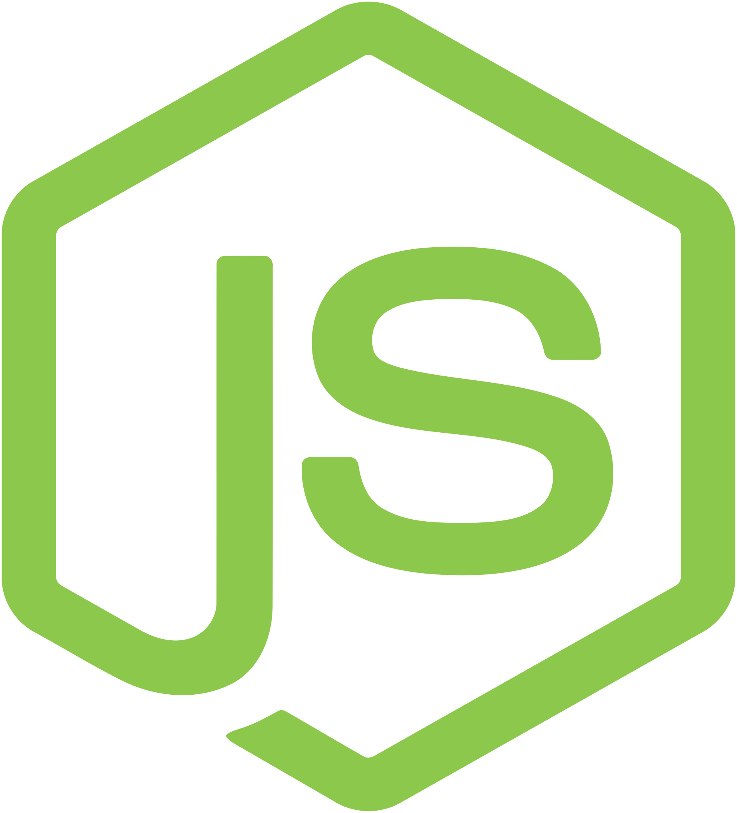

   

### About Me  

I like to mix things up from game engine development to making operating system from scratch Life is too boring to stick to the same old formula.

**Technologies i like working with**

 
 
 

### More About Me  

- **🔭 I’m currently working on :**  
  
  a project for Imagine Cup 2021 focussed on accessibilities during video conferencings  
  https://github.com/connecting-hands/connecting-hands
  
- **🌱 I’m currently learning :**
    
    
    
    
    
    
    
- **📫 How to reach me :**  

    Email me at ayushkumar121@outlook.com
    
- **😄 Pronouns :** He/Him
- **⚡ Fun fact :** Really like strategy games like factorio  

  (PS: My favorite reposity is https://github.com/ayushkumar121/Fairy-Engine)

 

 ## GitHub Stats

  
  

  
  

